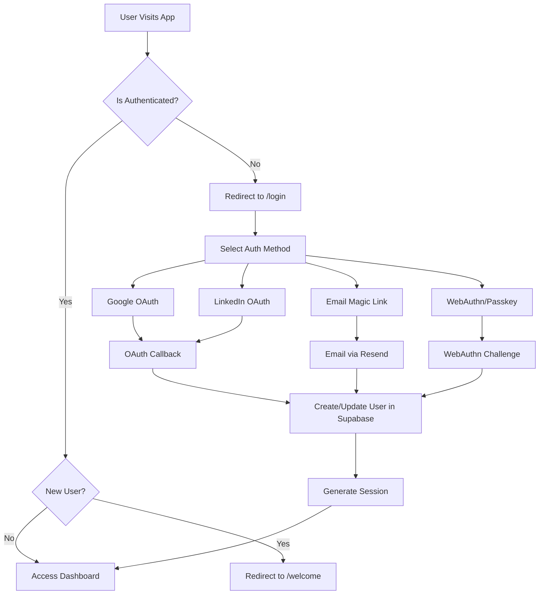

# Complete Authentication Implementation Guide - Supabase + Resend

## Overview

This comprehensive guide details a complete authentication system using Supabase as the database and backend service, combined with Resend for email delivery. This implementation provides a production-ready authentication solution using NextAuth.js with multiple authentication providers including Google OAuth, LinkedIn, Email (Magic Links), and WebAuthn/Passkeys.

---

## Table of Contents

1. [Architecture Overview](#architecture-overview)
2. [Dependencies & Setup](#dependencies--setup)
3. [Supabase Configuration](#supabase-configuration)
4. [NextAuth.js Configuration](#nextauthjs-configuration)
5. [Authentication Providers](#authentication-providers)
6. [Database Schema (Supabase)](#database-schema-supabase)
7. [Session Management](#session-management)
8. [Middleware & Route Protection](#middleware--route-protection)
9. [Authentication Pages & UI](#authentication-pages--ui)
10. [Email System with Resend](#email-system-with-resend)
11. [WebAuthn/Passkey Implementation](#webauthpasskey-implementation)
12. [Team Invitations](#team-invitations)
13. [Security Features](#security-features)
14. [Implementation Steps](#implementation-steps)
15. [Environment Variables](#environment-variables)
16. [Testing](#testing)
17. [Troubleshooting](#troubleshooting)

---

## Architecture Overview

### Authentication Flow Architecture



### Key Components

- **NextAuth.js**: Core authentication framework
- **Supabase**: PostgreSQL database with built-in auth features
- **Resend**: Email delivery service
- **Middleware**: Route protection and redirects
- **WebAuthn**: Hanko for passkey authentication
- **Session Strategy**: JWT-based sessions

---

## Dependencies & Setup

### Required Dependencies

```json
{
  "dependencies": {
    "next-auth": "^4.24.11",
    "@next-auth/supabase-adapter": "^1.0.0",
    "@supabase/supabase-js": "^2.39.0",
    "@teamhanko/passkeys-next-auth-provider": "^0.3.1",
    "resend": "^4.8.0",
    "@react-email/components": "^0.0.42",
    "zod": "^3.25.76",
    "sonner": "^2.0.7"
  }
}
```

### Installation

```bash
npm install next-auth @next-auth/supabase-adapter @supabase/supabase-js
npm install @teamhanko/passkeys-next-auth-provider
npm install resend @react-email/components
npm install zod sonner
```

---

## Supabase Configuration

### 1. Project Setup

1. Go to [Supabase Dashboard](https://supabase.com/dashboard)
2. Create a new project
3. Wait for the database to be ready
4. Get your project URL and anon key

### 2. Supabase Client Setup

Create `lib/supabase.ts`:

```typescript
import { createClient } from '@supabase/supabase-js'

const supabaseUrl = process.env.NEXT_PUBLIC_SUPABASE_URL!
const supabaseAnonKey = process.env.NEXT_PUBLIC_SUPABASE_ANON_KEY!

export const supabase = createClient(supabaseUrl, supabaseAnonKey)

// For server-side operations
const supabaseServiceRoleKey = process.env.SUPABASE_SERVICE_ROLE_KEY!

export const supabaseAdmin = createClient(supabaseUrl, supabaseServiceRoleKey, {
  auth: {
    autoRefreshToken: false,
    persistSession: false
  }
})
```

### 3. Database Tables Setup

Run these SQL commands in Supabase SQL Editor:

```sql
-- Enable necessary extensions
CREATE EXTENSION IF NOT EXISTS "uuid-ossp";

-- Users table (extends Supabase auth.users)
CREATE TABLE public.users (
  id UUID REFERENCES auth.users NOT NULL PRIMARY KEY,
  name TEXT,
  email TEXT UNIQUE,
  email_verified TIMESTAMPTZ,
  image TEXT,
  created_at TIMESTAMPTZ DEFAULT NOW(),
  contact_id TEXT,
  plan TEXT DEFAULT 'free',
  stripe_id TEXT UNIQUE,
  subscription_id TEXT UNIQUE,
  starts_at TIMESTAMPTZ,
  ends_at TIMESTAMPTZ
);

-- Accounts table for OAuth providers
CREATE TABLE public.accounts (
  id UUID DEFAULT uuid_generate_v4() PRIMARY KEY,
  user_id UUID REFERENCES public.users(id) ON DELETE CASCADE NOT NULL,
  type TEXT NOT NULL,
  provider TEXT NOT NULL,
  provider_account_id TEXT NOT NULL,
  refresh_token TEXT,
  access_token TEXT,
  expires_at INTEGER,
  token_type TEXT,
  scope TEXT,
  id_token TEXT,
  session_state TEXT,
  created_at TIMESTAMPTZ DEFAULT NOW(),
  updated_at TIMESTAMPTZ DEFAULT NOW(),
  
  UNIQUE(provider, provider_account_id)
);

-- Sessions table
CREATE TABLE public.sessions (
  id UUID DEFAULT uuid_generate_v4() PRIMARY KEY,
  session_token TEXT NOT NULL UNIQUE,
  user_id UUID REFERENCES public.users(id) ON DELETE CASCADE NOT NULL,
  expires TIMESTAMPTZ NOT NULL
);

-- Verification tokens table
CREATE TABLE public.verification_tokens (
  identifier TEXT NOT NULL,
  token TEXT NOT NULL UNIQUE,
  expires TIMESTAMPTZ NOT NULL,
  
  PRIMARY KEY (identifier, token)
);

-- Teams table
CREATE TABLE public.teams (
  id UUID DEFAULT uuid_generate_v4() PRIMARY KEY,
  name TEXT NOT NULL,
  slug TEXT UNIQUE,
  created_at TIMESTAMPTZ DEFAULT NOW(),
  updated_at TIMESTAMPTZ DEFAULT NOW()
);

-- User teams junction table
CREATE TABLE public.user_teams (
  id UUID DEFAULT uuid_generate_v4() PRIMARY KEY,
  user_id UUID REFERENCES public.users(id) ON DELETE CASCADE NOT NULL,
  team_id UUID REFERENCES public.teams(id) ON DELETE CASCADE NOT NULL,
  role TEXT DEFAULT 'member',
  created_at TIMESTAMPTZ DEFAULT NOW(),
  
  UNIQUE(user_id, team_id)
);

-- Invitations table
CREATE TABLE public.invitations (
  id UUID DEFAULT uuid_generate_v4() PRIMARY KEY,
  email TEXT NOT NULL,
  token TEXT NOT NULL UNIQUE,
  expires TIMESTAMPTZ NOT NULL,
  team_id UUID REFERENCES public.teams(id) ON DELETE CASCADE NOT NULL,
  created_at TIMESTAMPTZ DEFAULT NOW(),
  
  UNIQUE(email, team_id)
);

-- Documents table
CREATE TABLE public.documents (
  id UUID DEFAULT uuid_generate_v4() PRIMARY KEY,
  name TEXT NOT NULL,
  description TEXT,
  file TEXT NOT NULL,
  original_file TEXT,
  type TEXT,
  content_type TEXT,
  storage_type TEXT DEFAULT 'VERCEL_BLOB',
  num_pages INTEGER,
  owner_id UUID REFERENCES public.users(id) ON DELETE SET NULL,
  team_id UUID REFERENCES public.teams(id) ON DELETE CASCADE NOT NULL,
  assistant_enabled BOOLEAN DEFAULT false,
  advanced_excel_enabled BOOLEAN DEFAULT false,
  download_only BOOLEAN DEFAULT false,
  folder_id UUID,
  is_external_upload BOOLEAN DEFAULT false,
  created_at TIMESTAMPTZ DEFAULT NOW(),
  updated_at TIMESTAMPTZ DEFAULT NOW()
);

-- Enable Row Level Security (RLS)
ALTER TABLE public.users ENABLE ROW LEVEL SECURITY;
ALTER TABLE public.accounts ENABLE ROW LEVEL SECURITY;
ALTER TABLE public.sessions ENABLE ROW LEVEL SECURITY;
ALTER TABLE public.teams ENABLE ROW LEVEL SECURITY;
ALTER TABLE public.user_teams ENABLE ROW LEVEL SECURITY;
ALTER TABLE public.invitations ENABLE ROW LEVEL SECURITY;
ALTER TABLE public.documents ENABLE ROW LEVEL SECURITY;

-- RLS Policies

-- Users can read/update their own data
CREATE POLICY "Users can view own profile" ON public.users
  FOR SELECT USING (auth.uid() = id);

CREATE POLICY "Users can update own profile" ON public.users
  FOR UPDATE USING (auth.uid() = id);

-- Accounts policies
CREATE POLICY "Users can view own accounts" ON public.accounts
  FOR SELECT USING (auth.uid() = user_id);

CREATE POLICY "Users can insert own accounts" ON public.accounts
  FOR INSERT WITH CHECK (auth.uid() = user_id);

CREATE POLICY "Users can update own accounts" ON public.accounts
  FOR UPDATE USING (auth.uid() = user_id);

CREATE POLICY "Users can delete own accounts" ON public.accounts
  FOR DELETE USING (auth.uid() = user_id);

-- Sessions policies
CREATE POLICY "Users can view own sessions" ON public.sessions
  FOR SELECT USING (auth.uid() = user_id);

CREATE POLICY "Users can insert own sessions" ON public.sessions
  FOR INSERT WITH CHECK (auth.uid() = user_id);

CREATE POLICY "Users can update own sessions" ON public.sessions
  FOR UPDATE USING (auth.uid() = user_id);

CREATE POLICY "Users can delete own sessions" ON public.sessions
  FOR DELETE USING (auth.uid() = user_id);

-- Team policies
CREATE POLICY "Users can view teams they belong to" ON public.teams
  FOR SELECT USING (
    EXISTS (
      SELECT 1 FROM public.user_teams
      WHERE user_teams.team_id = teams.id
      AND user_teams.user_id = auth.uid()
    )
  );

-- User teams policies
CREATE POLICY "Users can view their team memberships" ON public.user_teams
  FOR SELECT USING (auth.uid() = user_id);

-- Document policies
CREATE POLICY "Users can view team documents" ON public.documents
  FOR SELECT USING (
    EXISTS (
      SELECT 1 FROM public.user_teams
      WHERE user_teams.team_id = documents.team_id
      AND user_teams.user_id = auth.uid()
    )
  );
```

---

## NextAuth.js Configuration

### Core Configuration (`pages/api/auth/[...nextauth].ts`)

```typescript
import { SupabaseAdapter } from "@next-auth/supabase-adapter";
import PasskeyProvider from "@teamhanko/passkeys-next-auth-provider";
import NextAuth, { type NextAuthOptions } from "next-auth";
import EmailProvider from "next-auth/providers/email";
import GoogleProvider from "next-auth/providers/google";
import LinkedInProvider from "next-auth/providers/linkedin";

import { supabaseAdmin } from "@/lib/supabase";
import { sendVerificationRequestEmail } from "@/lib/emails/send-verification-request";
import { sendWelcomeEmail } from "@/lib/emails/send-welcome";
import hanko from "@/lib/hanko";
import { CustomUser } from "@/lib/types";
import { generateChecksum } from "@/lib/utils/generate-checksum";

const VERCEL_DEPLOYMENT = !!process.env.VERCEL_URL;

function getMainDomainUrl(): string {
  if (process.env.NODE_ENV === "development") {
    return process.env.NEXTAUTH_URL || "http://localhost:3000";
  }
  return process.env.NEXTAUTH_URL || "https://app.yourapp.com";
}

export const authOptions: NextAuthOptions = {
  pages: {
    error: "/login",
  },
  providers: [
    GoogleProvider({
      clientId: process.env.GOOGLE_CLIENT_ID as string,
      clientSecret: process.env.GOOGLE_CLIENT_SECRET as string,
      allowDangerousEmailAccountLinking: true,
    }),
    LinkedInProvider({
      clientId: process.env.LINKEDIN_CLIENT_ID as string,
      clientSecret: process.env.LINKEDIN_CLIENT_SECRET as string,
      authorization: {
        params: { scope: "openid profile email" },
      },
      issuer: "https://www.linkedin.com/oauth",
      jwks_endpoint: "https://www.linkedin.com/oauth/openid/jwks",
      profile(profile, tokens) {
        const defaultImage = "https://cdn-icons-png.flaticon.com/512/174/174857.png";
        return {
          id: profile.sub,
          name: profile.name,
          email: profile.email,
          image: profile.picture ?? defaultImage,
        };
      },
      allowDangerousEmailAccountLinking: true,
    }),
    EmailProvider({
      async sendVerificationRequest({ identifier, url }) {
        const hasValidNextAuthUrl = !!process.env.NEXTAUTH_URL;
        let finalUrl = url;

        if (!hasValidNextAuthUrl) {
          const mainDomainUrl = getMainDomainUrl();
          const urlObj = new URL(url);
          const mainDomainObj = new URL(mainDomainUrl);
          urlObj.hostname = mainDomainObj.hostname;
          urlObj.protocol = mainDomainObj.protocol;
          urlObj.port = mainDomainObj.port || "";
          finalUrl = urlObj.toString();
        }

        if (process.env.NODE_ENV === "development") {
          const checksum = generateChecksum(finalUrl);
          const verificationUrlParams = new URLSearchParams({
            verification_url: finalUrl,
            checksum,
          });

          const baseUrl = hasValidNextAuthUrl
            ? process.env.NEXTAUTH_URL
            : getMainDomainUrl();

          const verificationUrl = `${baseUrl}/verify?${verificationUrlParams}`;
          console.log("[Login URL]", verificationUrl);
          return;
        } else {
          await sendVerificationRequestEmail({
            url: finalUrl,
            email: identifier,
          });
        }
      },
    }),
    PasskeyProvider({
      tenant: hanko,
      async authorize({ userId }) {
        const { data: user } = await supabaseAdmin
          .from('users')
          .select('*')
          .eq('id', userId)
          .single();
        
        if (!user) return null;
        return user;
      },
    }),
  ],
  adapter: SupabaseAdapter({
    url: process.env.NEXT_PUBLIC_SUPABASE_URL!,
    secret: process.env.SUPABASE_SERVICE_ROLE_KEY!,
  }),
  session: { strategy: "jwt" },
  
  cookies: {
    sessionToken: {
      name: `${VERCEL_DEPLOYMENT ? "__Secure-" : ""}next-auth.session-token`,
      options: {
        httpOnly: true,
        sameSite: "lax",
        path: "/",
        domain: VERCEL_DEPLOYMENT ? ".yourdomain.com" : undefined,
        secure: VERCEL_DEPLOYMENT,
      },
    },
  },
  
  callbacks: {
    signIn: async ({ user, account, profile }) => {
      // Add custom sign-in logic here
      if (!user.email) {
        return false;
      }
      return true;
    },

    jwt: async (params) => {
      const { token, user, trigger } = params;
      
      if (!token.email) {
        return {};
      }
      
      if (user) {
        token.user = user;
      }
      
      // Refresh user data on token update
      if (trigger === "update") {
        const user = token?.user as CustomUser;
        const { data: refreshedUser } = await supabaseAdmin
          .from('users')
          .select('*')
          .eq('id', user.id)
          .single();
        
        if (refreshedUser) {
          token.user = refreshedUser;
        } else {
          return {};
        }

        // Handle email change
        if (refreshedUser?.email !== user.email) {
          if (user.id && refreshedUser.email) {
            await supabaseAdmin
              .from('accounts')
              .delete()
              .eq('user_id', user.id);
          }
        }
      }
      return token;
    },
    
    session: async ({ session, token }) => {
      (session.user as CustomUser) = {
        id: token.sub,
        ...(token || session).user,
      };
      return session;
    },
  },
  
  events: {
    async createUser(message) {
      // Send welcome email
      const params = {
        user: {
          name: message.user.name,
          email: message.user.email,
        },
      };

      await sendWelcomeEmail(params);

      // Additional user setup in Supabase
      await supabaseAdmin
        .from('users')
        .update({
          created_at: new Date().toISOString(),
          plan: 'free',
        })
        .eq('id', message.user.id);
    },
    
    async signIn(message) {
      // Additional sign-in logic
      console.log("User signed in:", message.user.email);
    },
  },
};

export default NextAuth(authOptions);
```

---

## Authentication Providers

### 1. Google OAuth Provider

**Setup Steps:**

1. Go to [Google Cloud Console](https://console.cloud.google.com/)
2. Create OAuth 2.0 credentials
3. Set authorized redirect URIs:
   - Development: `http://localhost:3000/api/auth/callback/google`
   - Production: `https://yourdomain.com/api/auth/callback/google`

**Environment Variables:**
```bash
GOOGLE_CLIENT_ID=your_google_client_id
GOOGLE_CLIENT_SECRET=your_google_client_secret
```

### 2. LinkedIn Provider

**Setup Steps:**

1. Go to [LinkedIn Developer Portal](https://developer.linkedin.com/)
2. Create a LinkedIn App
3. Configure OAuth 2.0 settings

**Environment Variables:**
```bash
LINKEDIN_CLIENT_ID=your_linkedin_client_id
LINKEDIN_CLIENT_SECRET=your_linkedin_client_secret
```

### 3. Email Provider (Magic Links with Resend)

**Configuration in NextAuth:**
```typescript
EmailProvider({
  async sendVerificationRequest({ identifier, url }) {
    if (process.env.NODE_ENV === "development") {
      // Log URL in development
      console.log("[Login URL]", url);
    } else {
      // Send email via Resend in production
      await sendVerificationRequestEmail({
        url: url,
        email: identifier,
      });
    }
  },
})
```

### 4. WebAuthn/Passkey Provider

**Setup with Hanko:**
```typescript
PasskeyProvider({
  tenant: hanko,
  async authorize({ userId }) {
    const { data: user } = await supabaseAdmin
      .from('users')
      .select('*')
      .eq('id', userId)
      .single();
    
    if (!user) return null;
    return user;
  },
})
```

---

## Database Schema (Supabase)

### Core Authentication Tables

The database schema is designed to work seamlessly with NextAuth.js and Supabase:

#### Users Table
```sql
CREATE TABLE public.users (
  id UUID REFERENCES auth.users NOT NULL PRIMARY KEY,
  name TEXT,
  email TEXT UNIQUE,
  email_verified TIMESTAMPTZ,
  image TEXT,
  created_at TIMESTAMPTZ DEFAULT NOW(),
  contact_id TEXT,
  plan TEXT DEFAULT 'free',
  stripe_id TEXT UNIQUE,
  subscription_id TEXT UNIQUE,
  starts_at TIMESTAMPTZ,
  ends_at TIMESTAMPTZ
);
```

#### Accounts Table (OAuth Providers)
```sql
CREATE TABLE public.accounts (
  id UUID DEFAULT uuid_generate_v4() PRIMARY KEY,
  user_id UUID REFERENCES public.users(id) ON DELETE CASCADE NOT NULL,
  type TEXT NOT NULL,
  provider TEXT NOT NULL,
  provider_account_id TEXT NOT NULL,
  refresh_token TEXT,
  access_token TEXT,
  expires_at INTEGER,
  token_type TEXT,
  scope TEXT,
  id_token TEXT,
  session_state TEXT,
  created_at TIMESTAMPTZ DEFAULT NOW(),
  updated_at TIMESTAMPTZ DEFAULT NOW(),
  
  UNIQUE(provider, provider_account_id)
);
```

#### Sessions Table
```sql
CREATE TABLE public.sessions (
  id UUID DEFAULT uuid_generate_v4() PRIMARY KEY,
  session_token TEXT NOT NULL UNIQUE,
  user_id UUID REFERENCES public.users(id) ON DELETE CASCADE NOT NULL,
  expires TIMESTAMPTZ NOT NULL
);
```

### Team & Invitation System

```sql
-- Teams
CREATE TABLE public.teams (
  id UUID DEFAULT uuid_generate_v4() PRIMARY KEY,
  name TEXT NOT NULL,
  slug TEXT UNIQUE,
  created_at TIMESTAMPTZ DEFAULT NOW(),
  updated_at TIMESTAMPTZ DEFAULT NOW()
);

-- User Teams Junction
CREATE TABLE public.user_teams (
  id UUID DEFAULT uuid_generate_v4() PRIMARY KEY,
  user_id UUID REFERENCES public.users(id) ON DELETE CASCADE NOT NULL,
  team_id UUID REFERENCES public.teams(id) ON DELETE CASCADE NOT NULL,
  role TEXT DEFAULT 'member',
  created_at TIMESTAMPTZ DEFAULT NOW(),
  
  UNIQUE(user_id, team_id)
);

-- Invitations
CREATE TABLE public.invitations (
  id UUID DEFAULT uuid_generate_v4() PRIMARY KEY,
  email TEXT NOT NULL,
  token TEXT NOT NULL UNIQUE,
  expires TIMESTAMPTZ NOT NULL,
  team_id UUID REFERENCES public.teams(id) ON DELETE CASCADE NOT NULL,
  created_at TIMESTAMPTZ DEFAULT NOW(),
  
  UNIQUE(email, team_id)
);
```

---

## Email System with Resend

### Resend Setup (`lib/resend.ts`)

```typescript
import { JSXElementConstructor, ReactElement } from "react";
import { render } from "@react-email/components";
import { Resend } from "resend";

export const resend = process.env.RESEND_API_KEY
  ? new Resend(process.env.RESEND_API_KEY)
  : null;

export const sendEmail = async ({
  to,
  subject,
  react,
  from,
  marketing = false,
  system = false,
  verify = false,
  test = false,
  cc,
  replyTo,
  scheduledAt,
  unsubscribeUrl,
}: {
  to: string;
  subject: string;
  react: ReactElement<any, string | JSXElementConstructor<any>>;
  from?: string;
  marketing?: boolean;
  system?: boolean;
  verify?: boolean;
  test?: boolean;
  cc?: string | string[];
  replyTo?: string;
  scheduledAt?: string;
  unsubscribeUrl?: string;
}) => {
  if (!resend) {
    throw new Error("Resend not initialized. Please set RESEND_API_KEY environment variable.");
  }

  const plainText = await render(react, { plainText: true });

  // Determine sender based on email type
  const fromAddress =
    from ??
    (marketing
      ? "Your App <hello@yourapp.com>"
      : system
        ? "Your App <system@yourapp.com>"
        : verify
          ? "Your App <verify@yourapp.com>"
          : "Your App <hello@yourapp.com>");

  try {
    const { data, error } = await resend.emails.send({
      from: fromAddress,
      to: test ? "delivered@resend.dev" : to,
      cc: cc,
      replyTo: marketing ? "hello@yourapp.com" : replyTo,
      subject,
      react,
      scheduledAt,
      text: plainText,
      headers: {
        "X-Entity-Ref-ID": crypto.randomUUID(),
        ...(unsubscribeUrl ? { "List-Unsubscribe": unsubscribeUrl } : {}),
      },
    });

    if (error) {
      console.error(`Resend error: ${error.name} - ${error.message}`);
      throw error;
    }

    return data;
  } catch (exception) {
    console.error(`Unexpected error when sending email: ${exception}`);
    throw exception;
  }
};
```

### Email Verification Service

```typescript
// lib/emails/send-verification-request.ts
import VerificationLinkEmail from "@/components/emails/verification-link";
import { sendEmail } from "@/lib/resend";
import { generateChecksum } from "../utils/generate-checksum";

export const sendVerificationRequestEmail = async (params: {
  email: string;
  url: string;
}) => {
  const { url, email } = params;
  
  // Generate security checksum
  const checksum = generateChecksum(url);
  const verificationUrlParams = new URLSearchParams({
    verification_url: url,
    checksum,
  });

  const verificationUrl = `${process.env.NEXTAUTH_URL}/verify?${verificationUrlParams}`;
  const emailTemplate = VerificationLinkEmail({ url: verificationUrl });
  
  try {
    await sendEmail({
      to: email,
      subject: "Sign in to Your App",
      react: emailTemplate,
      verify: true,
      test: process.env.NODE_ENV === "development",
    });
  } catch (e) {
    console.error("Failed to send verification email:", e);
    throw e;
  }
};
```

### Welcome Email Service

```typescript
// lib/emails/send-welcome.ts
import WelcomeEmail from "@/components/emails/welcome";
import { sendEmail } from "@/lib/resend";

export const sendWelcomeEmail = async (params: {
  user: {
    name?: string | null;
    email?: string | null;
  };
}) => {
  const { user } = params;
  
  if (!user.email) {
    throw new Error("User email is required");
  }

  const emailTemplate = WelcomeEmail({ 
    name: user.name || "there" 
  });
  
  try {
    await sendEmail({
      to: user.email,
      subject: "Welcome to Your App!",
      react: emailTemplate,
      marketing: true,
      test: process.env.NODE_ENV === "development",
    });
  } catch (e) {
    console.error("Failed to send welcome email:", e);
    // Don't throw here to avoid blocking user creation
  }
};
```

### Email Templates with React Email

```typescript
// components/emails/verification-link.tsx
import React from "react";
import {
  Body,
  Button,
  Container,
  Head,
  Hr,
  Html,
  Preview,
  Section,
  Tailwind,
  Text,
} from "@react-email/components";

const VerificationLinkEmail = ({ url }: { url: string }) => {
  return (
    <Html>
      <Head />
      <Preview>Sign in to your account with this magic link</Preview>
      <Tailwind>
        <Body className="mx-auto my-auto bg-white font-sans">
          <Container className="mx-auto my-10 max-w-[500px] rounded border border-solid border-gray-200 px-10 py-5">
            <Text className="mx-0 mb-8 mt-4 p-0 text-center text-2xl font-normal">
              <span className="font-bold tracking-tighter">Your App</span>
            </Text>
            
            <Text className="mx-0 my-7 p-0 text-center text-xl font-semibold text-black">
              Your Magic Sign-in Link
            </Text>
            
            <Text className="text-sm leading-6 text-black">
              Click the button below to sign in to your account. This link will expire in 24 hours.
            </Text>
            
            <Section className="my-8 text-center">
              <Button
                className="rounded bg-black px-6 py-3 text-center text-sm font-semibold text-white no-underline"
                href={url}
              >
                Sign In
              </Button>
            </Section>
            
            <Text className="text-sm leading-6 text-black">
              Or copy and paste this URL into your browser:
            </Text>
            <Text className="break-all font-mono text-xs text-purple-600">
              {url}
            </Text>
            
            <Hr className="my-8" />
            <Text className="text-xs text-gray-400">
              If you didn't request this email, you can safely ignore it.
            </Text>
          </Container>
        </Body>
      </Tailwind>
    </Html>
  );
};

export default VerificationLinkEmail;
```

```typescript
// components/emails/welcome.tsx
import React from "react";
import {
  Body,
  Button,
  Container,
  Head,
  Hr,
  Html,
  Preview,
  Section,
  Tailwind,
  Text,
} from "@react-email/components";

const WelcomeEmail = ({ name }: { name: string }) => {
  return (
    <Html>
      <Head />
      <Preview>Welcome to Your App! Let's get started.</Preview>
      <Tailwind>
        <Body className="mx-auto my-auto bg-white font-sans">
          <Container className="mx-auto my-10 max-w-[500px] rounded border border-solid border-gray-200 px-10 py-5">
            <Text className="mx-0 mb-8 mt-4 p-0 text-center text-2xl font-normal">
              <span className="font-bold tracking-tighter">Your App</span>
            </Text>
            
            <Text className="mx-0 my-7 p-0 text-center text-xl font-semibold text-black">
              Welcome to Your App, {name}! 🎉
            </Text>
            
            <Text className="text-sm leading-6 text-black">
              Thanks for signing up! We're excited to have you on board. Here are some next steps to get you started:
            </Text>
            
            <Section className="my-6">
              <Text className="text-sm leading-6 text-black">
                • <strong>Complete your profile:</strong> Add your information to personalize your experience
              </Text>
              <Text className="text-sm leading-6 text-black">
                • <strong>Explore features:</strong> Discover what you can do with your account
              </Text>
              <Text className="text-sm leading-6 text-black">
                • <strong>Get help:</strong> Check out our documentation and support resources
              </Text>
            </Section>
            
            <Section className="my-8 text-center">
              <Button
                className="rounded bg-blue-600 px-6 py-3 text-center text-sm font-semibold text-white no-underline"
                href={`${process.env.NEXTAUTH_URL}/dashboard`}
              >
                Get Started
              </Button>
            </Section>
            
            <Hr className="my-8" />
            <Text className="text-xs text-gray-400">
              Need help? Reply to this email or contact us at help@yourapp.com
            </Text>
          </Container>
        </Body>
      </Tailwind>
    </Html>
  );
};

export default WelcomeEmail;
```

---

## Session Management

### JWT Strategy Configuration

```typescript
export const authOptions: NextAuthOptions = {
  session: { strategy: "jwt" },
  
  callbacks: {
    jwt: async (params) => {
      const { token, user, trigger } = params;
      
      // Initial sign in
      if (user) {
        token.user = user;
      }
      
      // Token refresh/update
      if (trigger === "update") {
        const { data: refreshedUser } = await supabaseAdmin
          .from('users')
          .select('*')
          .eq('id', user.id)
          .single();
        
        if (refreshedUser) {
          token.user = refreshedUser;
        }
      }
      
      return token;
    },
    
    session: async ({ session, token }) => {
      (session.user as CustomUser) = {
        id: token.sub,
        ...(token || session).user,
      };
      return session;
    },
  },
}
```

### Using Sessions in Components

```typescript
import { useSession, signIn, signOut } from "next-auth/react";

function Component() {
  const { data: session, status } = useSession();
  
  if (status === "loading") return <p>Loading...</p>;
  
  if (status === "unauthenticated") {
    return <button onClick={() => signIn()}>Sign in</button>;
  }
  
  return (
    <div>
      <p>Signed in as {session?.user?.email}</p>
      <button onClick={() => signOut()}>Sign out</button>
    </div>
  );
}
```

### Server-side Session Access

```typescript
// In API routes
import { getServerSession } from "next-auth/next";
import { authOptions } from "./auth/[...nextauth]";

export default async function handler(req: NextApiRequest, res: NextApiResponse) {
  const session = await getServerSession(req, res, authOptions);
  
  if (!session) {
    return res.status(401).json({ error: "Unauthorized" });
  }
  
  // Use session.user.id for Supabase queries
  const { data } = await supabaseAdmin
    .from('documents')
    .select('*')
    .eq('owner_id', session.user.id);
  
  res.json({ documents: data });
}
```

---

## Middleware & Route Protection

### Main Middleware (`middleware.ts`)

```typescript
import { NextFetchEvent, NextRequest, NextResponse } from "next/server";
import { getToken } from "next-auth/jwt";

export const config = {
  matcher: [
    "/((?!api/|_next/|_static|favicon.ico|sitemap.xml).*)",
  ],
};

export default async function middleware(req: NextRequest) {
  const path = req.nextUrl.pathname;
  const token = await getToken({ req, secret: process.env.NEXTAUTH_SECRET });

  // Public paths that don't require authentication
  const publicPaths = ['/login', '/register', '/verify'];
  const isPublicPath = publicPaths.some(p => path.startsWith(p));

  // UNAUTHENTICATED - Redirect to login
  if (!token && !isPublicPath) {
    const loginUrl = new URL('/login', req.url);
    if (path !== '/') {
      loginUrl.searchParams.set('next', encodeURIComponent(path));
    }
    return NextResponse.redirect(loginUrl);
  }

  // NEW USER - Redirect to welcome (first 10 seconds after signup)
  if (
    token?.user?.created_at &&
    new Date(token.user.created_at).getTime() > Date.now() - 10000 &&
    path !== '/welcome'
  ) {
    return NextResponse.redirect(new URL('/welcome', req.url));
  }

  // AUTHENTICATED on login page - Redirect to dashboard
  if (token && path === '/login') {
    const nextPath = req.nextUrl.searchParams.get('next') || '/dashboard';
    return NextResponse.redirect(new URL(decodeURIComponent(nextPath), req.url));
  }

  return NextResponse.next();
}
```

### Supabase RLS Helper

```typescript
// lib/supabase-server.ts
import { createServerSupabaseClient } from '@supabase/auth-helpers-nextjs';
import { getServerSession } from "next-auth/next";
import { authOptions } from "@/pages/api/auth/[...nextauth]";

export const getSupabaseServerClient = async (req: any, res: any) => {
  const session = await getServerSession(req, res, authOptions);
  
  const supabase = createServerSupabaseClient({ req, res });
  
  if (session?.user?.id) {
    // Set the user context for RLS
    await supabase.auth.setAuth(session.user.id);
  }
  
  return supabase;
};
```

---

## Team Invitations

### Create Invitation API

```typescript
// pages/api/teams/[teamId]/invitations/create.ts
import { NextApiRequest, NextApiResponse } from "next";
import { getServerSession } from "next-auth/next";
import { supabaseAdmin } from "@/lib/supabase";
import { sendTeamInvitationEmail } from "@/lib/emails/send-team-invitation";
import { authOptions } from "@/pages/api/auth/[...nextauth]";

export default async function handler(req: NextApiRequest, res: NextApiResponse) {
  if (req.method !== "POST") {
    return res.status(405).json({ error: "Method not allowed" });
  }

  const session = await getServerSession(req, res, authOptions);
  if (!session) {
    return res.status(401).json({ error: "Unauthorized" });
  }

  const { teamId } = req.query;
  const { email } = req.body;

  try {
    // Check if user has permission to invite to this team
    const { data: userTeam } = await supabaseAdmin
      .from('user_teams')
      .select('role')
      .eq('team_id', teamId)
      .eq('user_id', session.user.id)
      .single();

    if (!userTeam || (userTeam.role !== 'admin' && userTeam.role !== 'owner')) {
      return res.status(403).json({ error: "Not authorized to invite members" });
    }

    // Create invitation
    const token = crypto.randomUUID();
    const expires = new Date();
    expires.setDate(expires.getDate() + 7); // 7 days expiry

    const { data: invitation, error } = await supabaseAdmin
      .from('invitations')
      .insert({
        email,
        token,
        expires: expires.toISOString(),
        team_id: teamId,
      })
      .select()
      .single();

    if (error) {
      throw error;
    }

    // Get team info for email
    const { data: team } = await supabaseAdmin
      .from('teams')
      .select('name')
      .eq('id', teamId)
      .single();

    // Send invitation email
    const inviteLink = `${process.env.NEXTAUTH_URL}/api/teams/${teamId}/invitations/accept?token=${token}&email=${encodeURIComponent(email)}`;
    
    await sendTeamInvitationEmail({
      email,
      invitedBy: session.user.name || session.user.email,
      teamName: team?.name || "Your Team",
      inviteLink,
    });

    res.json({ success: true, invitation });
  } catch (error) {
    console.error("Invitation creation error:", error);
    res.status(500).json({ error: "Failed to create invitation" });
  }
}
```

### Accept Invitation API

```typescript
// pages/api/teams/[teamId]/invitations/accept.ts
import { NextApiRequest, NextApiResponse } from "next";
import { getServerSession } from "next-auth/next";
import { supabaseAdmin } from "@/lib/supabase";
import { authOptions } from "@/pages/api/auth/[...nextauth]";

export default async function handler(req: NextApiRequest, res: NextApiResponse) {
  if (req.method !== "GET") {
    return res.status(405).json({ error: "Method not allowed" });
  }

  const { teamId, token, email } = req.query;
  const session = await getServerSession(req, res, authOptions);

  // If not authenticated, redirect to login with invitation context
  if (!session) {
    const redirectUrl = `/login?next=${encodeURIComponent(`/api/teams/${teamId}/invitations/accept?token=${token}&email=${email}`)}`;
    return res.redirect(redirectUrl);
  }

  try {
    // Find and validate invitation
    const { data: invitation, error: inviteError } = await supabaseAdmin
      .from('invitations')
      .select('*')
      .eq('token', token)
      .eq('email', email)
      .eq('team_id', teamId)
      .single();

    if (inviteError || !invitation) {
      return res.status(404).json({ error: "Invalid invitation" });
    }

    if (invitation.email !== session.user.email) {
      return res.status(403).json({ error: "Email mismatch" });
    }

    if (new Date() > new Date(invitation.expires)) {
      return res.status(410).json({ error: "Invitation expired" });
    }

    // Check if user is already a team member
    const { data: existingMember } = await supabaseAdmin
      .from('user_teams')
      .select('id')
      .eq('user_id', session.user.id)
      .eq('team_id', teamId)
      .single();

    if (existingMember) {
      return res.redirect('/dashboard?invitation=already-member');
    }

    // Add user to team
    const { error: memberError } = await supabaseAdmin
      .from('user_teams')
      .insert({
        user_id: session.user.id,
        team_id: teamId,
        role: 'member',
      });

    if (memberError) {
      throw memberError;
    }

    // Delete the invitation
    await supabaseAdmin
      .from('invitations')
      .delete()
      .eq('token', token);

    return res.redirect('/dashboard?invitation=accepted');
  } catch (error) {
    console.error("Accept invitation error:", error);
    return res.status(500).json({ error: "Failed to accept invitation" });
  }
}
```

---

## Implementation Steps

### Step 1: Supabase Setup

```bash
# 1. Create Supabase project at https://supabase.com
# 2. Get your project URL and keys
# 3. Run the database schema SQL commands provided above
```

### Step 2: Project Setup

```bash
# Install dependencies
npm install next-auth @next-auth/supabase-adapter @supabase/supabase-js
npm install resend @react-email/components zod sonner
npm install @teamhanko/passkeys-next-auth-provider

# Create project structure
mkdir -p lib/{emails,utils} components/emails pages/api/auth
```

### Step 3: Environment Configuration

Create `.env.local`:

```bash
# NextAuth
NEXTAUTH_URL=http://localhost:3000
NEXTAUTH_SECRET=your-secret-key

# Supabase
NEXT_PUBLIC_SUPABASE_URL=https://your-project.supabase.co
NEXT_PUBLIC_SUPABASE_ANON_KEY=your-anon-key
SUPABASE_SERVICE_ROLE_KEY=your-service-role-key

# OAuth Providers
GOOGLE_CLIENT_ID=your-google-client-id
GOOGLE_CLIENT_SECRET=your-google-client-secret
LINKEDIN_CLIENT_ID=your-linkedin-client-id
LINKEDIN_CLIENT_SECRET=your-linkedin-client-secret

# Resend
RESEND_API_KEY=your-resend-api-key

# WebAuthn (Optional)
HANKO_API_KEY=your-hanko-api-key
NEXT_PUBLIC_HANKO_TENANT_ID=your-tenant-id
```

### Step 4: Core Files Setup

1. Create `lib/supabase.ts` (Supabase client)
2. Create `lib/resend.ts` (Email service)
3. Create `pages/api/auth/[...nextauth].ts` (NextAuth config)
4. Create `middleware.ts` (Route protection)
5. Create authentication pages
6. Create email templates

### Step 5: Testing

Test all flows:
- Google/LinkedIn OAuth
- Email magic links
- Team invitations
- Route protection
- Email delivery

---

## Environment Variables

### Complete Environment Variables List

```bash
# Required - NextAuth
NEXTAUTH_URL=http://localhost:3000
NEXTAUTH_SECRET=your-nextauth-secret-minimum-32-characters

# Required - Supabase
NEXT_PUBLIC_SUPABASE_URL=https://your-project.supabase.co
NEXT_PUBLIC_SUPABASE_ANON_KEY=eyJ...your-anon-key
SUPABASE_SERVICE_ROLE_KEY=eyJ...your-service-role-key

# Required - Resend
RESEND_API_KEY=re_...your-resend-api-key

# Optional - Google OAuth
GOOGLE_CLIENT_ID=your-google-client-id
GOOGLE_CLIENT_SECRET=your-google-client-secret

# Optional - LinkedIn OAuth
LINKEDIN_CLIENT_ID=your-linkedin-client-id
LINKEDIN_CLIENT_SECRET=your-linkedin-client-secret

# Optional - WebAuthn/Passkeys
HANKO_API_KEY=your-hanko-api-key
NEXT_PUBLIC_HANKO_TENANT_ID=your-tenant-id
```

---

## Testing

### Database Testing with Supabase

```typescript
// __tests__/supabase.test.ts
import { supabaseAdmin } from '@/lib/supabase';

describe('Supabase Integration', () => {
  test('should create user', async () => {
    const { data, error } = await supabaseAdmin
      .from('users')
      .insert({
        email: 'test@example.com',
        name: 'Test User',
      })
      .select()
      .single();
    
    expect(error).toBeNull();
    expect(data.email).toBe('test@example.com');
  });

  test('should enforce RLS policies', async () => {
    // Test that users can only access their own data
    const { data, error } = await supabaseAdmin
      .from('users')
      .select('*')
      .eq('id', 'wrong-user-id');
    
    expect(data).toHaveLength(0);
  });
});
```

### Email Testing with Resend

```typescript
// __tests__/email.test.ts
import { sendEmail } from '@/lib/resend';
import WelcomeEmail from '@/components/emails/welcome';

describe('Email Service', () => {
  test('should send welcome email', async () => {
    const result = await sendEmail({
      to: 'test@example.com',
      subject: 'Welcome!',
      react: WelcomeEmail({ name: 'Test' }),
      test: true, // Use Resend test mode
    });
    
    expect(result.id).toBeDefined();
  });
});
```

---

## Troubleshooting

### Common Supabase Issues

**1. RLS Policy Errors**
```sql
-- Check if RLS is enabled
SELECT schemaname, tablename, rowsecurity 
FROM pg_tables 
WHERE schemaname = 'public';

-- View current policies
SELECT * FROM pg_policies WHERE schemaname = 'public';
```

**2. Connection Issues**
```typescript
// Test Supabase connection
const { data, error } = await supabase.from('users').select('count');
console.log('Connection test:', { data, error });
```

**3. Migration Issues**
```bash
# Reset database (DANGER: deletes all data)
supabase db reset

# Apply specific migration
supabase migration up --to 20231201000000
```

### Common Resend Issues

**1. API Key Issues**
```typescript
// Test Resend connection
const { data, error } = await resend.emails.send({
  from: 'test@yourdomain.com',
  to: 'delivered@resend.dev',
  subject: 'Test Email',
  html: '<p>Test</p>',
});
```

**2. Domain Verification**
- Verify your domain in Resend dashboard
- Check DNS records are properly set
- Use resend.domains.verify() API

**3. Email Delivery Issues**
```bash
# Check delivery status
curl -X GET 'https://api.resend.com/emails/{email_id}' \
  -H 'Authorization: Bearer YOUR_API_KEY'
```

### Debugging Tips

**Enable NextAuth Debug Mode:**
```bash
NEXTAUTH_DEBUG=true
```

**Supabase Debug Mode:**
```typescript
const supabase = createClient(url, key, {
  auth: {
    debug: process.env.NODE_ENV === 'development'
  }
});
```

**Check Session State:**
```javascript
// In browser console
console.log(await fetch('/api/auth/session').then(r => r.json()))
```

---

## Production Deployment

### Supabase Production Setup

1. **Database Backups**: Enable automatic backups
2. **Monitoring**: Set up database monitoring
3. **Connection Pooling**: Configure pgBouncer
4. **Security**: Review RLS policies

### Resend Production Setup

1. **Domain Verification**: Verify your sending domain
2. **DKIM/SPF**: Configure email authentication
3. **Webhooks**: Set up delivery webhooks
4. **Rate Limits**: Monitor sending quotas

### Environment-specific Configurations

```typescript
// lib/config.ts
export const config = {
  supabase: {
    url: process.env.NEXT_PUBLIC_SUPABASE_URL!,
    anonKey: process.env.NEXT_PUBLIC_SUPABASE_ANON_KEY!,
    serviceRoleKey: process.env.SUPABASE_SERVICE_ROLE_KEY!,
  },
  resend: {
    apiKey: process.env.RESEND_API_KEY!,
  },
  nextAuth: {
    url: process.env.NEXTAUTH_URL!,
    secret: process.env.NEXTAUTH_SECRET!,
  },
  isProduction: process.env.NODE_ENV === 'production',
};
```

---

This guide provides a complete, production-ready authentication system using Supabase and Resend. The implementation includes all necessary security features, email templates, database schemas, and deployment considerations for building modern web applications.